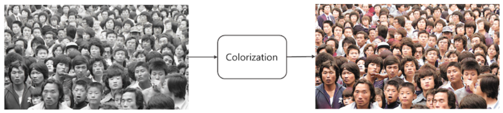
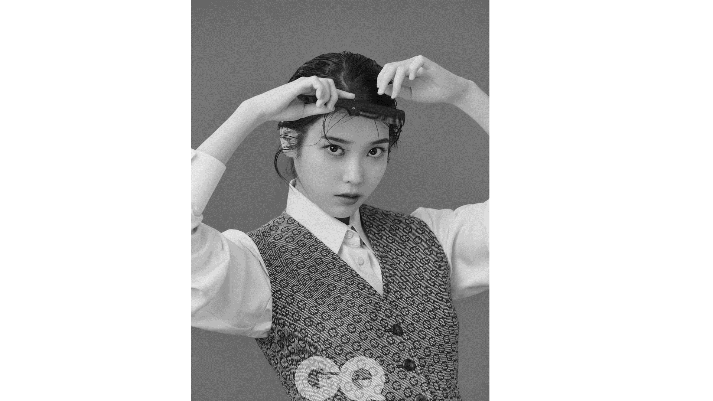

# PetMemories 반려동물 image2video 서비스

# Image Colorization / Image2Video

## **1. Image Colorization**

**1.1 background**

현재 1950~1980년대 이미지는 흑백 이미지인 경우가 대다수이며 이러한 오래된 기록물, 콘텐츠에 대한 Colorization 기술에 대한 Needs가 증가하고 있습니다. 따라서 이러한 흑백 이미지에 컬러를 입히는 **AI 복원 기술은 사회/경제적 가치 측면에서 필요성이 높아지고 있습니다.**

**1.2 model**

- **Generative Adversarial Networks (GANs)**: 사진을 컬러화하고 자연스럽게 보이도록 하는 데 사용됩니다.
- **Convolutional Neural Networks (CNNs)**: 이미지 처리 및 패턴 인식을 통해 사진의 컬러화 및 디테일 향상을 도와줍니다.
- **Recurrent Neural Networks (RNNs)**: 연속적인 프레임을 생성하여 정적 이미지를 동영상처럼 보이게 하는 데 사용될 수 있습니다.
    
                                                                 **<인물 사진>(black-to-color)**
    
    
    

                                                        ****

---

                                         **<자연을 배경, 많은 사람이 포함된 사진>(black-to-color)**

**1.3 Research Services**

- [Deep Image AI](https://deep-image.ai/)의 컬러화 모델
- [DeOldify](https://www.youtube.com/watch?v=l3UXXid04Ys) 영상 컬러화 모델
    
    [https://www.youtube.com/watch?v=l3UXXid04Ys](https://www.youtube.com/watch?v=l3UXXid04Ys)
    

## 2. Image2Video

**2.1 background**

정지된 이미지를 생동감 있게 변환하는 데 중점을 두고, 사용자들은 간단히 사진을 업로드하는 것만으로 결과물을 얻을 수 있어야 한다.

**2.2 model**

- **딥러닝(Deep Learning)**: 딥러닝을 통해 사진의 다양한 요소를 분석하고, 이를 기반으로 색상을 예측하여 컬러화합니다. 또한, 사진의 특정 부분을 인식하여 움직임을 생성합니다.
- **GAN(Generative Adversarial Networks)**: GAN은 두 개의 신경망(생성자와 판별자)으로 구성되며, 생성자는 새로운 데이터를 생성하고 판별자는 이를 평가합니다. 이 과정을 통해 더 정교하고 자연스러운 움직임을 생성할 수 있습니다.
- **Face Landmark Detection**: 얼굴의 주요 특징점을 인식하여 눈 깜박임, 미소 등 자연스러운 움직임을 추가합니다.

**2.3 Research Services**

- **Clipfly**: [Clipfly](https://www.clipfly.ai/video-ai/ai-image-animator/)는 AI를 사용하여 정지 사진을 생동감 있는 동영상으로 변환하는 서비스를 제공
- **MyHeritage Deep Nostalgia**: [MyHeritage Deep Nostalgia](https://www.myheritage.com/deep-nostalgia)는 가족 사진을 애니메이션으로 변환하여 가족의 역사를 생생하게 경험
- **Cutout.Pro**: [Cutout.Pro](https://www.cutout.pro/photo-animer-gif-emoji)는 포트레이트, 그림, 만화 등을 동영상으로 변환하여 생동감을 더하는 서비스를 제공

**2.4 Purpose**

<aside>
💡 대량의 데이터로 학습을 시키고 모델화 해서 (인물,사물) 이미 서비스화 시킨 사이트 **多 (굉장히 많음 특히 Nostalgia는 완벽)

반려동물(개,고양이) 등은 인간보다 수명이 짧음
반려동물이 가족의 일원으로 자리잡은 오늘날, 그들과의 추억을 더 생생하게 간직하려는 사람들이 많다고 추측 ⇒ 수요층이 있음

1. 서비스명 :  PetMemories

2. 목표 : 반려동물의 사진을 동영상으로 변환하여 디지털 액자나 스크린을 통해 추억을 간직 하고자 하는 사람들에게 제공

3. 주요 기능 : 사진 애니메이션, 동영상 생성(gif, wav 형식도 가능할 듯), 맞춤형 디지털 액자 판매**

- **세부사항**
    - **기술적 구성 요소**
        - **AI 기술**:
            - **GANs (Generative Adversarial Networks)**: 사진을 동영상으로 변환.
            - **Deep Learning**: 반려동물의 특징을 학습하여 자연스러운 움직임 생성.
            - **Face Landmark Detection**: 반려동물의 얼굴을 인식하고 특정 포인트를 기반으로 움직임 생성.
        - **플랫폼**:
            - 웹 애플리케이션 및 모바일 애플리케이션.
            - 디지털 액자와의 통합을 위한 IoT 기술.
        - **클라우드 서비스**:
            - Google Cloud, AWS, Azure 등을 이용한 데이터 저장 및 처리.
            - 사용자 업로드 및 결과물 제공을 위한 안정적인 서버 환경 구축.
    - **기능 상세**
        - **사진 업로드**: 사용자가 반려동물의 사진을 업로드.
        - **동영상 변환**: AI 기술을 활용하여 사진을 애니메이션 동영상으로 변환.
        - **미리보기**: 변환된 동영상을 미리보기 가능.
        - **맞춤형 설정**: 사용자가 원하는 배경 음악, 효과 등을 선택하여 맞춤형 동영상 제작.
        (배경음악이 액자의 본질과 어울리지 않을 수 있음 보류)
        - **디지털 액자 주문**: 변환된 동영상을 디지털 액자로 주문 가능.
        - **공유 기능**: 소셜 미디어 공유 기능 제공.
    - **사용자 경험(UX)**
        - **쉽고 직관적인 인터페이스**: 사진 업로드부터 동영상 생성까지의 과정이 간단하고 직관적이어야 함.
        - **고객 지원**: 실시간 채팅, 이메일 지원 등을 통해 고객 문의 및 문제 해결.(보류)
        - **다국어 지원**: 다양한 언어를 지원하여 글로벌 시장 타겟.(보류)
    - **비즈니스 모델**
        - **프리미엄 서비스**: 기본 서비스는 무료로 제공하되, 프리미엄 기능(고해상도 동영상, 추가 효과 등)은 유료로 제공.
        - **디지털 액자 판매**: 맞춤형 디지털 액자 판매로 수익 창출.
        - **구독 모델**: 월간 또는 연간 구독 모델을 통해 정기적으로 새로운 콘텐츠를 제공.
    - **마케팅 전략**
        - **타겟 마케팅**: 반려동물을 키우는 가족, 애완동물 커뮤니티, SNS 사용자 등을 대상으로 집중 마케팅.
        - **소셜 미디어 캠페인**: 인스타그램, 페이스북, 트위터 등에서 캠페인 진행.
        - **파트너십**: 반려동물 관련 기업과의 제휴 및 협력.
        - **입소문 마케팅**: 초기 사용자의 만족도를 높여 자연스러운 입소문을 유도.
        - **<제일중요> 초기에 무조건 무료로 서비스를 이용하게 해주고(액자판매), 이 후 모델 개발 단계와 클라이언트 반응에 따라 서비스로도 수익화를 할건지 결정**
    - **운영 및 유지보수**
        - **데이터 보안**: 사용자 데이터의 보안과 프라이버시 보호.
        - **정기 업데이트**: AI 모델 및 서비스 기능의 정기 업데이트.
        - **고객 피드백 반영**: 고객의 피드백을 반영하여 지속적으로 서비스 개선.
</aside>

## 3. Img2Vid 워크플로우 및 파이썬 기반 ComfyUI 데모 실행 결과

**3.1 워크플로우(ComfyUI)**

- **사용모델 
1. [SVD(Stable Video Diffusion)](https://huggingface.co/stabilityai/stable-video-diffusion-img2vid-xt) - stabilityai/stable-video-diffusion-img2vid-xt
2. [JuggernautXL](https://civitai.com/models/133005/juggernaut-xl)**

- **Stable VIdeo Diffusion 간단 Logic**
1. image 모델을 학습
2. 이미지 모델을 video 모델로 학장하여, 대형 비디오 데이터셋에 대해 사전 학습
3. 비디오 모델을 소형 고품질 비디오 데이터셋에 대해 미세조정

- **SVD 모델 가중치**
1. SVD - 756 x 1024 해상도로 14 프레임을 생성하도록 학습된 모델
2. **SVD TX** - 756 x 1024 해상도로 25 프레임을 생성하도록 학습된 모델(사용한 모델)

- **모델 파라미터**
1. **모션 버켓 id(Motion bucket id)** - 비디오에서 얼마나 많이 움직일 것인지를 제어, 높은 값을 주면 움직임이 많아지고 0~255 입력 가능
2. **FPS -** 초당 프레임(fps: frame per second)는 모델이 생성할 프레임의 수를 제어, 최적의 성능을 위해 5~30 정도로 입력
3. **보정 수준(Augmentation level) -** 보정 수준은 초기 이미지에 추가되는 잡음량, 초기 이미지를 더 많이 변경하거나 기본 크기에서 벗어난 동영상을 생성할 때 사용

### **Text2Img모델을 통해 prompt로 제어한 이미지 생성 후  Img2Vid로 영상 생성**

(Checkpoint Loader에 SVD모델 입력) ⇒ **Load Image로 이미지 바로 로드 후 영상 생성 가능**

**3.2 실행 결과**

**소요시간 (순서대로 14m, 22m, 21m) 두번째 사진 클릭**

[https://img1.daumcdn.net/thumb/R1280x0/?scode=mtistory2&fname=https%3A%2F%2Fblog.kakaocdn.net%2Fdn%2FcEoRHS%2FbtsEvv0oLJ8%2F2Pdo36IIxEWkfBNSypkg50%2Fimg.webp](https://img1.daumcdn.net/thumb/R1280x0/?scode=mtistory2&fname=https%3A%2F%2Fblog.kakaocdn.net%2Fdn%2FcEoRHS%2FbtsEvv0oLJ8%2F2Pdo36IIxEWkfBNSypkg50%2Fimg.webp)

[https://img1.daumcdn.net/thumb/R1280x0/?scode=mtistory2&fname=https%3A%2F%2Fblog.kakaocdn.net%2Fdn%2FBi8FR%2FbtsBzKGb3t3%2Fd8yJa9kso63GOY9UngfRpk%2Fimg.webp](https://img1.daumcdn.net/thumb/R1280x0/?scode=mtistory2&fname=https%3A%2F%2Fblog.kakaocdn.net%2Fdn%2FBi8FR%2FbtsBzKGb3t3%2Fd8yJa9kso63GOY9UngfRpk%2Fimg.webp)

[cat.mp4](cat.mp4)

[https://img1.daumcdn.net/thumb/R1280x0/?scode=mtistory2&fname=https%3A%2F%2Fblog.kakaocdn.net%2Fdn%2F4Kz2f%2FbtsEm7UK4yz%2FPJk5BGRh7v41SxpM9TJVvK%2Fimg.webp](https://img1.daumcdn.net/thumb/R1280x0/?scode=mtistory2&fname=https%3A%2F%2Fblog.kakaocdn.net%2Fdn%2F4Kz2f%2FbtsEm7UK4yz%2FPJk5BGRh7v41SxpM9TJVvK%2Fimg.webp)

**<권장사항인 RAM 32GB / RTX3090 메모리 16GB를 만족한 모델의 성능>**

[https://stable-diffusion-art.com/wp-content/uploads/2023/11/000003.mp4](https://stable-diffusion-art.com/wp-content/uploads/2023/11/000003.mp4)